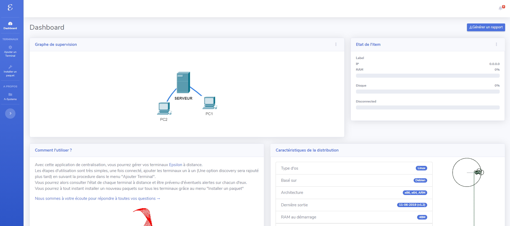

# epsilon-centralisation

Cεntralizε is a supervision tool that offers a way to control and manage all the terminals with the Epsilon OS. Installed on the server, it gives to the administrator the possibility to manage from remote the terminals with a quite clean and simple dashboard. The administrator can then, install several packages in all the terminals at the same time, restore the terminals and get alerted of any issue. 

This application was created during the project module (4th year at the Higher School of Computer Science, SIQ) by : 
- Benmeziane Hadjer
- Bensalem Riad
- Bousri Mohamedcharafeddine
- Debbagh Abdelkader Nadir
- Leghettas Mohamedhichem
- Merouani Massinissa

